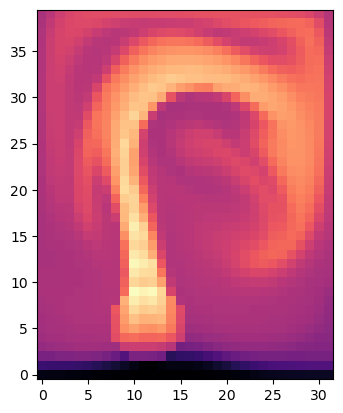

# Computational Fluid Dynamics

There are various programs I wrote for simulating different problems in Fluid Dynamics, mostly based on numerical simulation of the Navier-Stokes equations in simplified scenarios like incompressible flows. I use MATLAB and Python for writing these codes. 

## 1. 2D smoke flow using Python

The incompressible form of **Navier-Stokes equation** is given by:\
\
$$\rho \frac{d \mathbf{v}}{dt} = - \mathbf{\nabla} P + \rho \textbf{g} + \mu \nabla^2 \mathbf{v}$$

### Step 1: Marker Grid
\

### Step 2: Forward Flow Time Step
\

This is the time evolution of the hot smoke that moves upwards.

### Step 3: Velocity Field
\

This Python code uses the phiflow model and the Boussinesq approximation. The Boussinesq approximation is a simplifying assumption often used in fluid dynamics, particularly in the study of buoyancy-driven flows such as convection. It assumes that the density variations in the fluid are negligible so that the fluid can be considered incompressible. This allows for the simplification of the Navier-Stokes equations, making them more amenable to numerical solution. The code solves a Poisson equation with the boundary conditions of the domain, and updates the old velocity field with the computed pressure gradient.
