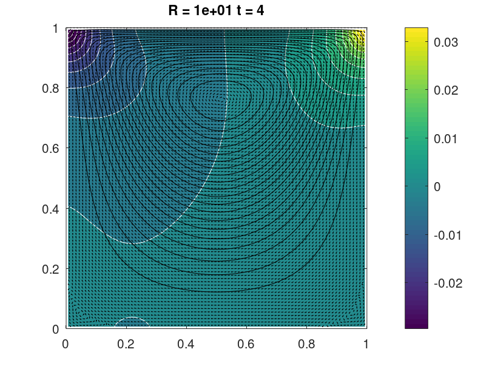
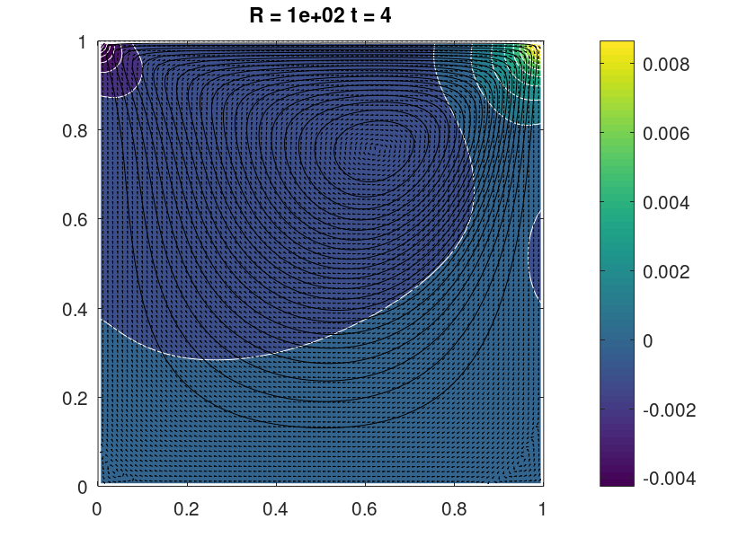
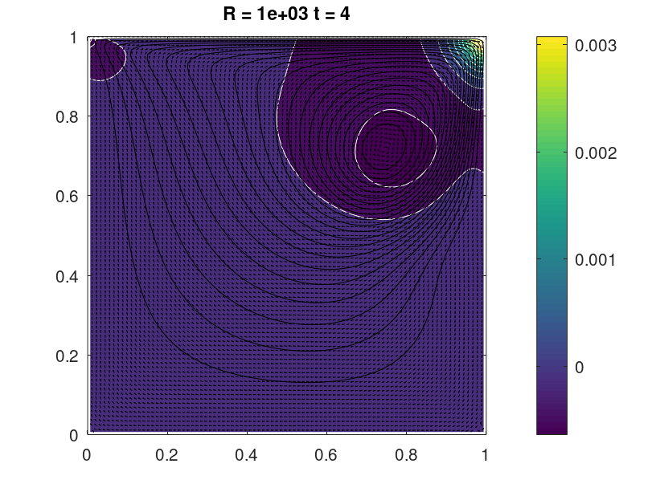

# Computational Fluid Dynamics

There are various programs I wrote for simulating different problems in Fluid Dynamics, mostly based on numerical simulation of the Navier-Stokes equations in simplified scenarios like incompressible flows. I use MATLAB and Python for writing these codes. 

## 1. 2D smoke flow using Python

This Python code uses the phiflow model and the Boussinesq approximation. The Boussinesq approximation is a simplifying assumption often used in fluid dynamics, particularly in the study of buoyancy-driven flows such as convection. It assumes that the density variations in the fluid are negligible so that the fluid can be considered incompressible. This allows for the simplification of the Navier-Stokes equations, making them more amenable to numerical solution. The code solves a Poisson equation with the boundary conditions of the domain, and updates the old velocity field with the computed pressure gradient.

All the differentiable operators used in the Navier-Stokes equation are already available in [phiflow](https://tum-pbs.github.io/PhiFlow/) package.

The incompressible form of **Navier-Stokes equation** is given by:\
\
$$\rho \frac{d \mathbf{v}}{dt} = - \mathbf{\nabla} P + \rho \textbf{g} + \mu \nabla^2 \mathbf{v}$$

### Step 0: Installing phiflow

Run this command in the Python interface you're using:
```
!pip install --upgrade --quiet phiflow==3.1
#!pip install --upgrade --quiet git+https://github.com/tum-pbs/PhiFlow@develop
```

### Step 1: Setting up the domain and Marker Grid
\
I'm creating a first CenteredGrid here, which is initialized by a Sphere geometry object. This will represent the inflow region where hot smoke is generated. I have defined a Box of size 160 x 128. This is the physical scale in terms of spatial units in the simulation, i.e., a velocity of magnitude 1 will move the smoke density by 1 unit per 1 time unit.

Below are the different kinds of extrapolation schemes used in the code. Please look into this in details from [here](https://tum-pbs.github.io/PhiFlow/Staggered_Grids.html).


The inflow sphere is located at x = 30 along the first axis, and y = 15 (within the domain box).

Next, create grids for the quantities you want to simulate (velocity and smoke density).

### Step 2: Forward Flow Time Step
\
By repeatedly calling the step function, the time evolution of the hot smoke can be studied.


The hot plume is starting to rise. Because of the inflow being located off-center to the left (with x position 30), the plume will curve towards the right when it hits the top wall of the domain.


This is the time evolution (over 20 secs) of the hot smoke that moves upwards.

### Step 3: Velocity Field
\
You can also take a look at the velocities.


# 2. Lid-Driven Cavity Flow using MATLAB

Varying the Reynolds number for a viscous flow model, I used MATLAB to simulate viscous incompressible fuid flow in a 2D box using projection method. The code uses finite differencing and has different components like  discretization on a staggered grid, an implicit viscosity step, explicit treatment of non-linear advection terms, as well as the visualization of the solution over time. The code can be broken up into 7 segments: 

### 1. Initialization and Parameter Setup:
Parameters such as Reynolds number (R), time step (dt), final simulation time (tf), dimensions of the computational domain (lx and ly), and number of grid points (nx and ny) are defined. The number of time steps (nt) is computed based on the final time and time step. Grid points along x and y directions are generated using linspace, and a mesh grid (X and Y) is created using meshgrid(x, y).

### 2. Initial and Boundary Conditions:
Initial velocities U and V are initialized as zero arrays. Boundary conditions for velocity components in North, South, East, West directions (uN, vN, uS, vS, uW, vW, uE, vE) are set based on the problem setup. These conditions represent Dirichlet or Neumann boundary conditions.

### 3. Implicit Viscosity:
Setting up matrices and performing calculations to handle the viscous terms implicitly. This is achieved using a linear solver (chol) applied to the discretized form of the equations.

### 4. Pressure Correction:
Pressure correction is applied to enforce incompressibility. This is done by solving for pressure (P) iteratively to satisfy the divergence-free condition div(v) = 0.

### 5. Nonlinear Terms Handling: 
Computing the nonlinear terms in the Navier-Stokes equations explicitly. It uses a finite difference method to calculate the convective and diffusive terms.
   
### 6. Visualization: 
Contours and quiver plots to visualize pressure (P) and velocity components (U, V) respectively. Allows monitoring the flow evolution over time at specified time intervals (nsteps).
   
### 7. Loop Over Time Steps: 
The main loop iterates over time steps (k) from 1 to the total number of time steps (nt). Within each iteration, it updates the velocity and pressure fields based on the computed terms and boundary conditions.

## Results
Visualization of the time evolution of a 2D viscous flow, done by a colormap-isoline plot for pressure and  normalized quiver and streamline plot for the velocity field $(u,v)$ for three values of Reynolds number $R$: $10,100$ and $1000$ with time step $dt=0.1s$






